# Workflow Diagrams - Passive Reconnaissance Tool

This document contains visual workflow diagrams using Mermaid JS to illustrate the tool's architecture, execution flow, and data processing pipeline.

---

## 1. High-Level Execution Flow

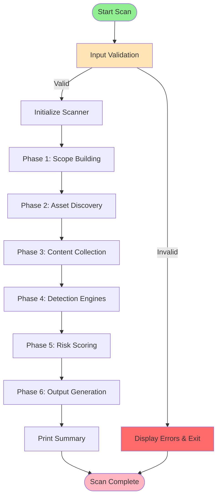

---

## 2. Detailed Phase-by-Phase Workflow

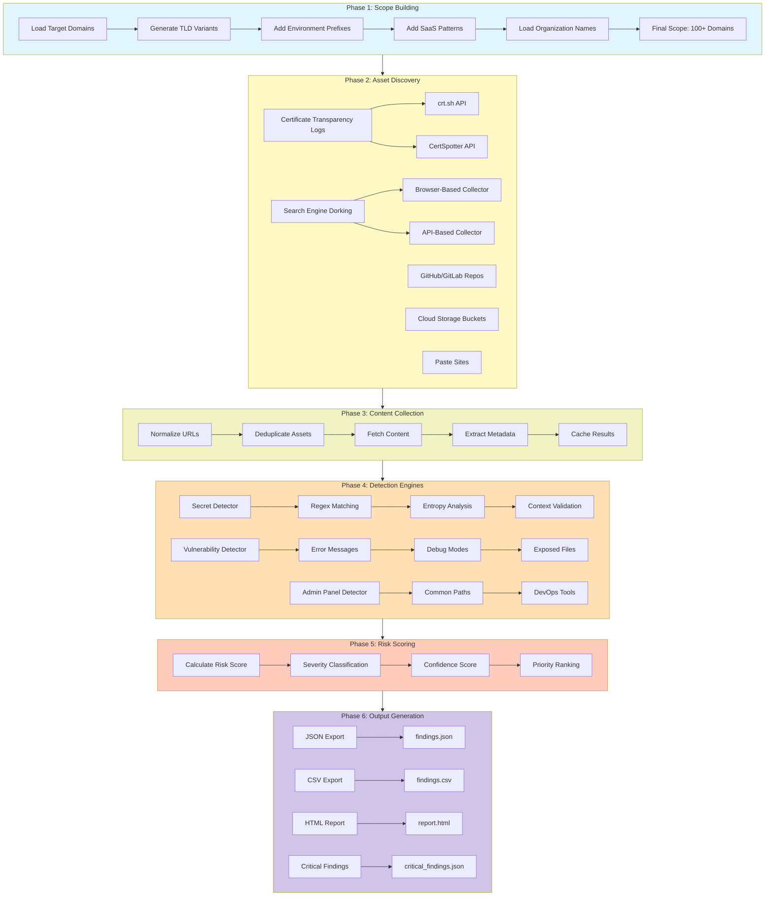

---

## 3. Browser-Based Search Engine Collector Architecture

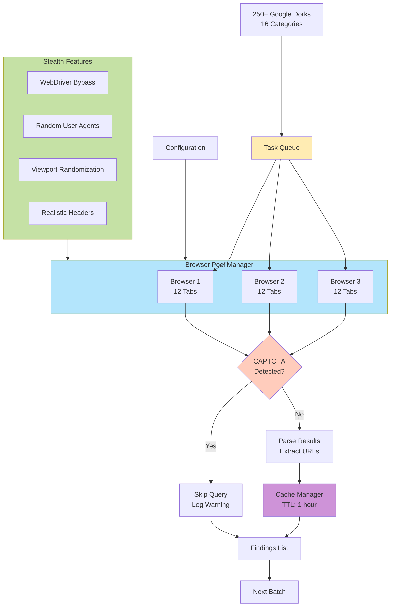

---

## 4. Data Collection Architecture

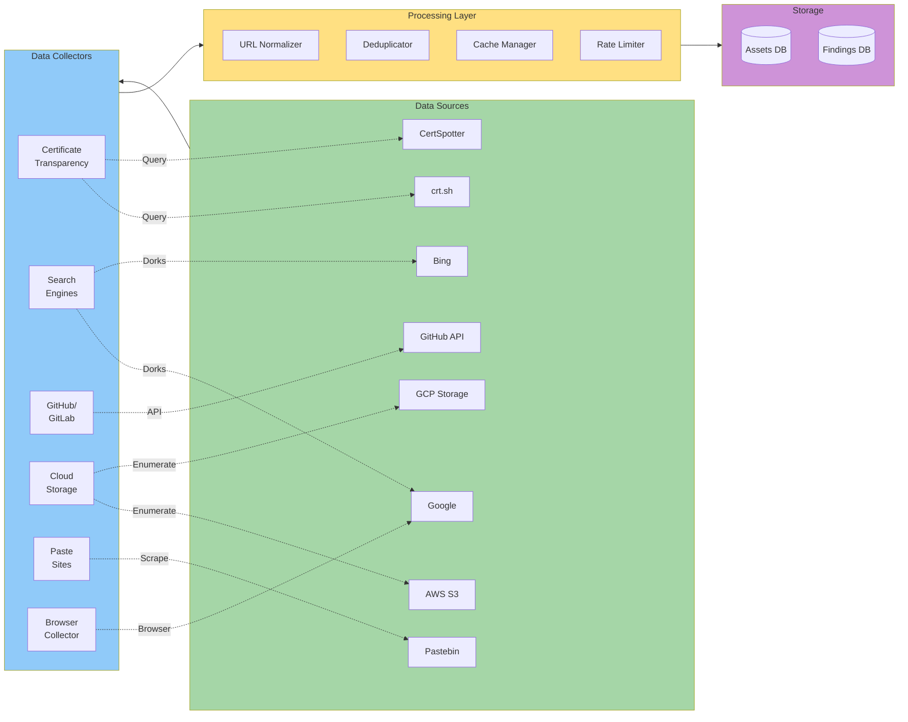

---

## 5. Secret Detection Pipeline

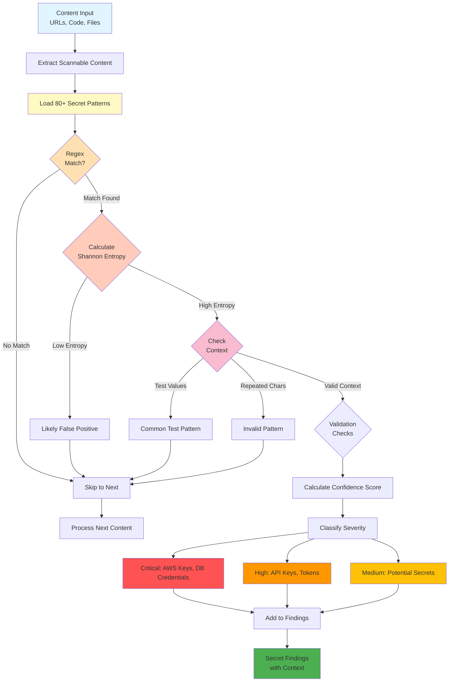

---

## 6. Module Dependency Graph

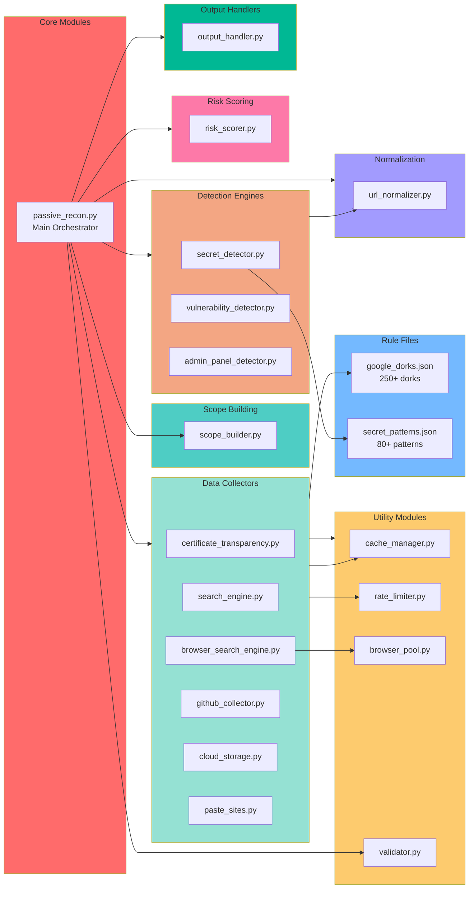

---

## 7. Risk Scoring Algorithm

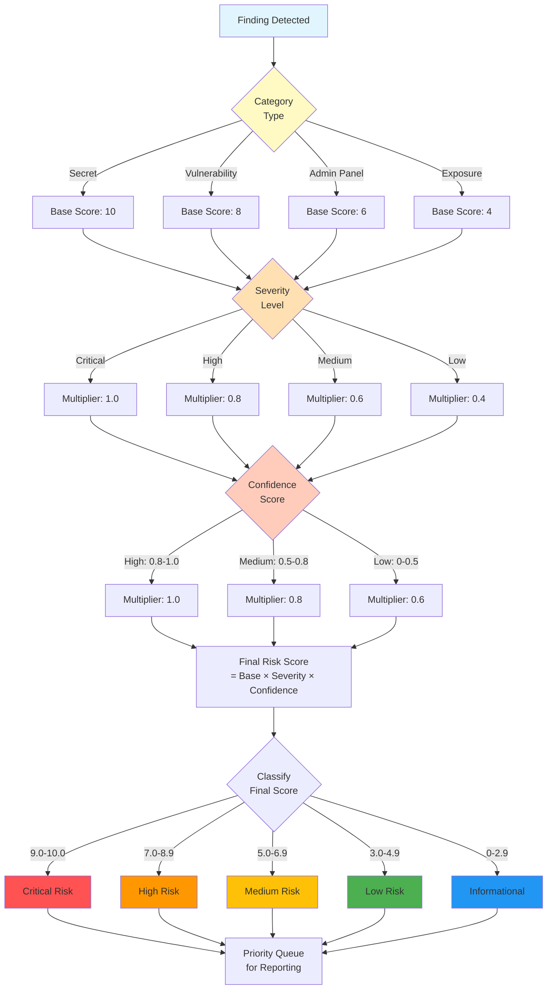

---

## 8. Configuration & Validation Flow

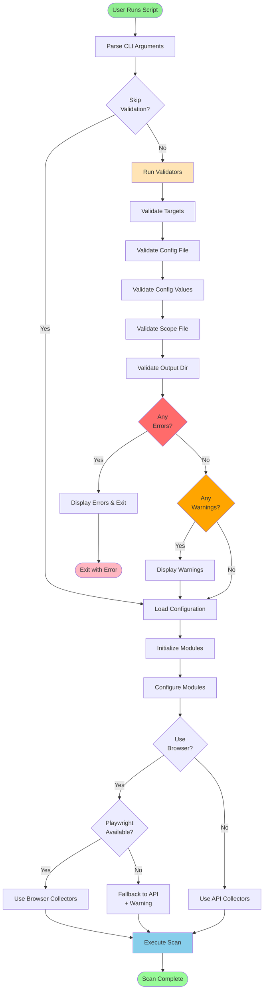

---

## 9. Output Generation Pipeline

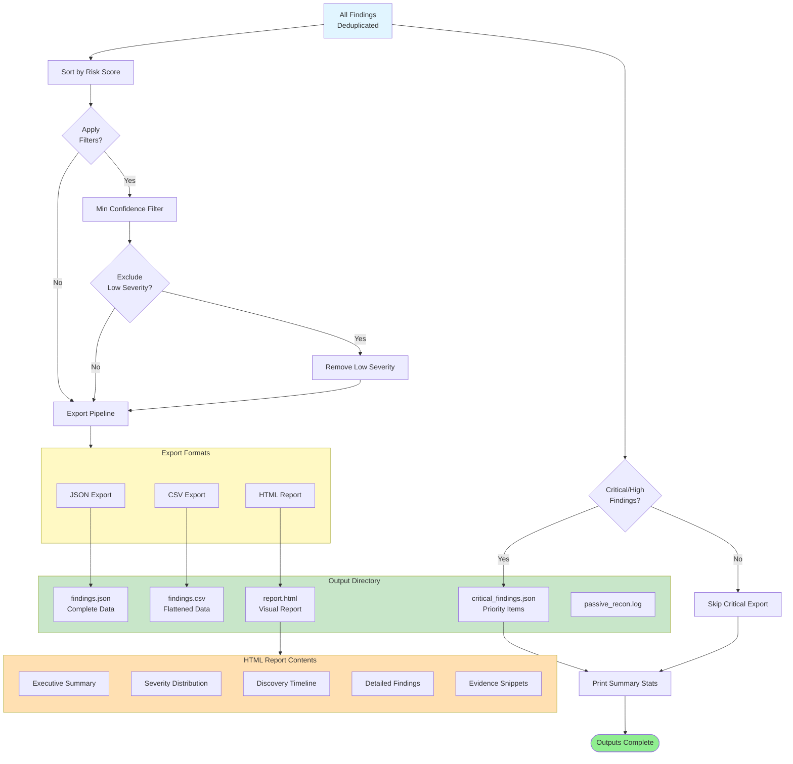

---

## 10. Concurrent Execution Model (Browser Mode)

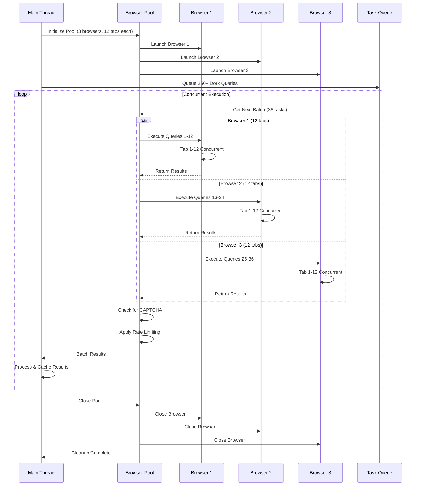

---

## 11. Error Handling & Recovery Flow

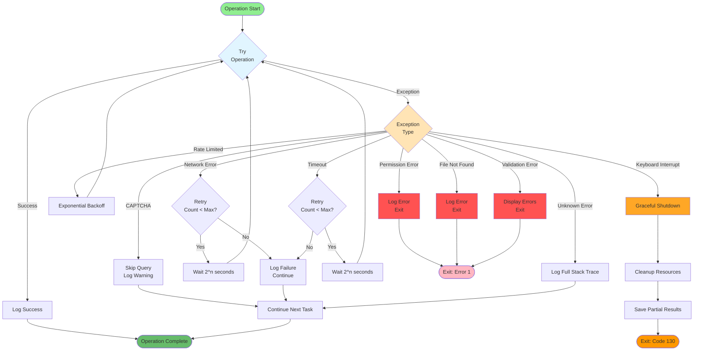

---

## 12. Complete System Architecture

```mermaid
graph TB
    subgraph UserInterface[User Interface Layer]
        CLI[Command Line Interface]
        Validator[Input Validator]
        Config[Configuration Loader]
    end

    subgraph Core[Core Orchestration Layer]
        Main[Main Scanner<br/>passive_recon.py]
        Phase[Phase Manager]
        Logger[Logging System]
    end

    subgraph Collection[Data Collection Layer]
        Scope[Scope Builder]
        CT[CT Logs Collector]
        SE[Search Engine Collector]
        BSE[Browser Collector]
        GH[GitHub Collector]
        CS[Cloud Collector]
        PS[Paste Collector]
    end

    subgraph Processing[Processing Layer]
        Norm[URL Normalizer]
        Dedup[Deduplicator]
        Cache[Cache Manager]
        Rate[Rate Limiter]
    end

    subgraph Detection[Detection Layer]
        Secret[Secret Detector<br/>80+ Patterns]
        Vuln[Vulnerability Detector]
        Admin[Admin Panel Detector]
    end

    subgraph Analysis[Analysis Layer]
        Risk[Risk Scorer]
        Priority[Priority Ranker]
        Filter[Filter Engine]
    end

    subgraph Output[Output Layer]
        JSON[JSON Exporter]
        CSV[CSV Exporter]
        HTML[HTML Reporter]
        Critical[Critical Filter]
    end

    subgraph External[External Resources]
        BrowserPool[Browser Pool<br/>Playwright]
        Rules[Rules Files<br/>Dorks & Patterns]
        APIs[External APIs<br/>GitHub, Search]
    end

    UserInterface --> Core
    Core --> Collection
    Collection --> Processing
    Processing --> Detection
    Detection --> Analysis
    Analysis --> Output

    Collection -.-> External
    Detection -.-> External
    Processing -.-> External

    Output --> Results[(Output Files<br/>results/)]

    style UserInterface fill:#E3F2FD
    style Core fill:#FFF3E0
    style Collection fill:#E8F5E9
    style Processing fill:#F3E5F5
    style Detection fill:#FCE4EC
    style Analysis fill:#FFF9C4
    style Output fill:#E0F2F1
    style External fill:#EFEBE9
    style Results fill:#C5CAE9
```

---

## Usage in Documentation

These diagrams can be embedded in GitHub, GitLab, and other Markdown viewers that support Mermaid JS.

### Rendering:
- **GitHub:** Native support (automatically renders)
- **GitLab:** Native support
- **VS Code:** Use Mermaid preview extensions
- **Online:** Copy to [Mermaid Live Editor](https://mermaid.live/)

### Integration Examples:

```markdown
# Quick Reference in README.md

See the [high-level execution flow](WORKFLOW_DIAGRAMS.md#1-high-level-execution-flow) for an overview.

# In Documentation
For detailed architecture, refer to:
- [Module Dependencies](WORKFLOW_DIAGRAMS.md#6-module-dependency-graph)
- [Browser Architecture](WORKFLOW_DIAGRAMS.md#3-browser-based-search-engine-collector-architecture)
- [Secret Detection Pipeline](WORKFLOW_DIAGRAMS.md#5-secret-detection-pipeline)
```

---

**Generated:** 2025-10-29
**Version:** 1.0.0
**Tool:** Passive Reconnaissance Tool for External Pentesting
